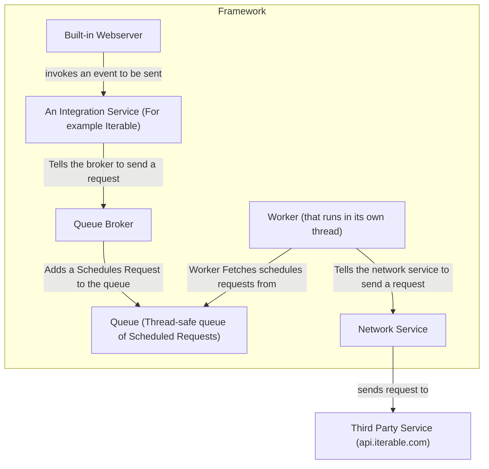
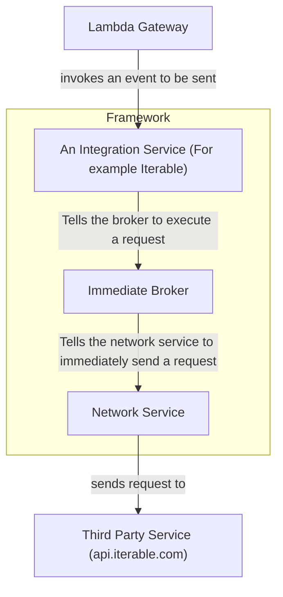

# Octoroute

A lightweight headless, developer-first, general-purpose pipeline system written in Java.

## Releases

 - All releases can be found in the /release/ folder

## Different setups

 - Built in webserver
 - Lambda function

## Features

  - Integrates with multiple third party services
  - Brokers, queue and workers
  - DLQ (Dead Letter Queue)

## Integrations

 - Iterable - iterable.com
   - Update user by ID

## Getting Started

Compilation

 - `javac -cp octoroute.jar Main.java`

Execution

 - `java -cp ".;octoroute.jar" Main`

## Architecture overview

Webserver (Scheduled Worker Broker) Based

Lambda (Immediate Broker) Based

## Software Principles

- Lightweight
- POJO
- SOLID
- OOP
- DI
- Self-Contained

## License

 - TBD
