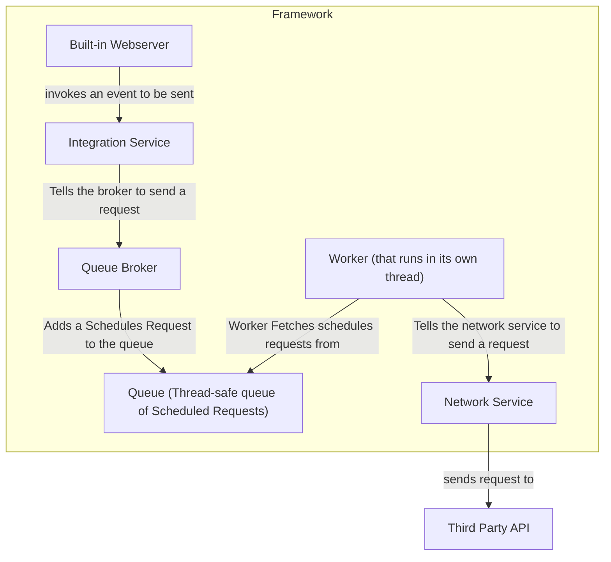
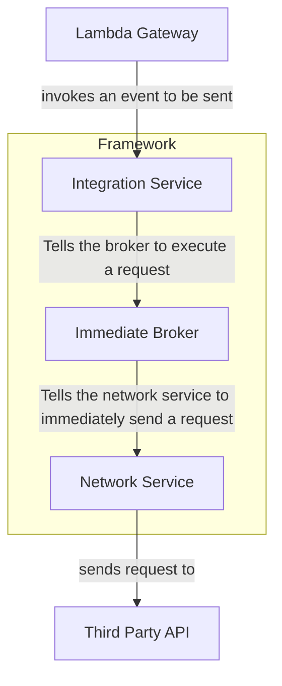

# Octoroute

A lightweight headless, developer-first, general-purpose pipeline system written in Java.

## Releases

 - All releases can be found in the /release/ folder

## Different setups

 - Built in webserver
 - Lambda function

## Features

  - Integrates with multiple third party services
  - Brokers, queue and workers
  - DLQ (Dead Letter Queue)

## Integrations

 - Iterable
   - Update user by ID
   - Send events
 - Meta Conversion API
   - Send events
 - Google Measurement Protocol
   - Send events
 - Discord
   - Send simple message

## Getting Started

Compilation

 - `javac -cp octoroute.jar Main.java`

Execution

 - `java -cp ".;octoroute.jar" Main`

## Architecture overview

Webserver (Scheduled Worker Broker) Based

Lambda (Immediate Broker) Based

## Software Principles

- Lightweight
- POJO
- SOLID
- OOP
- DI
- Self-Contained

## License

TLDR:

 - ✅ You can use, modify, and share this software freely
 - ✅ Companies and individuals can use it internally, even for commercial work
 - ✅ Contributions are welcome and may be re-licensed as part of the project improvements
 - 🚫 You cannot use it to build or offer a competing product or service
 - 🚫 You cannot wrap it into a paid platform, SaaS, or resale tool without a commercial license
 - ⚠️ This software is provided as-is, with no warranty or liability
 
[Read the full license here](LICENSE.md)
